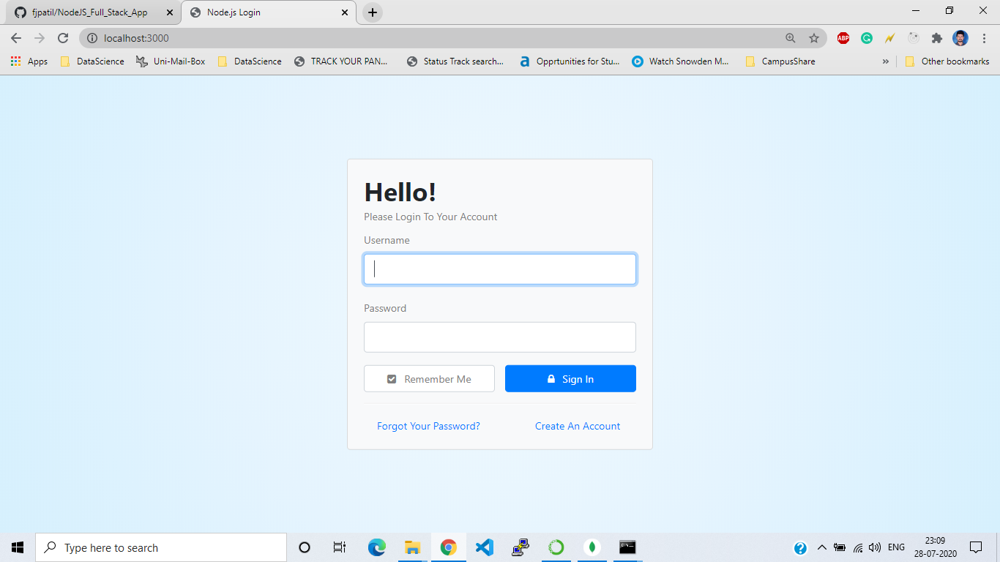
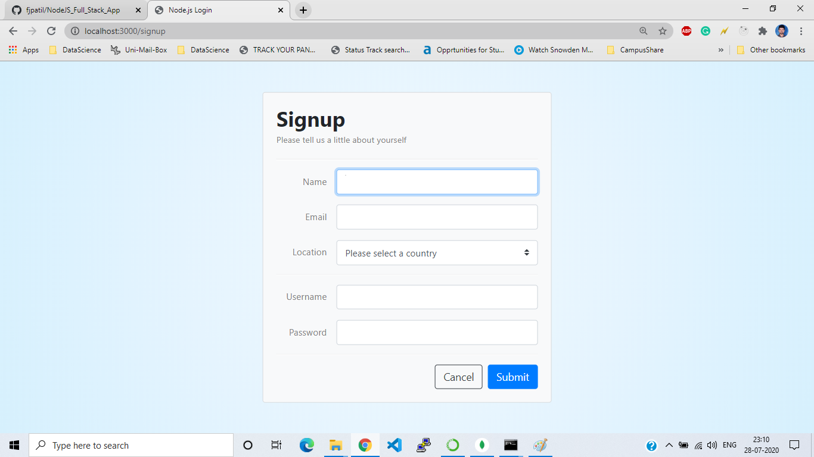
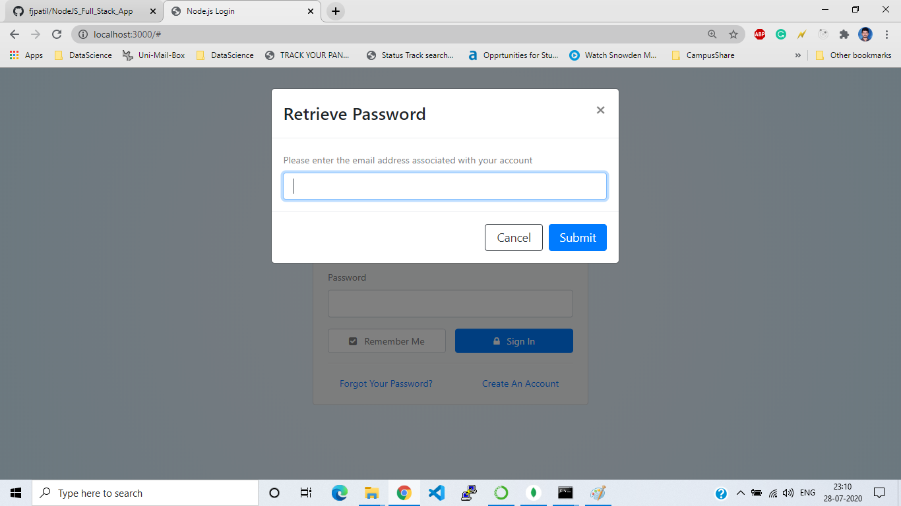
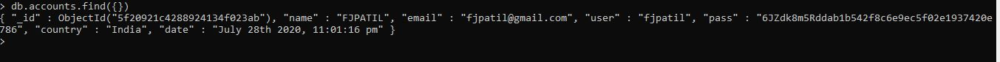

# NodeJS_Full_Stack_App

# Installation & Setup

1. Install Node.js & MongoDB if you haven't already.

2. Clone this repository and install its dependencies  
•	git clone https://github.com/fjpatil/NodeJS_Full_Stack_App.git  
•	cd node-login  
•	npm install  

3. In a separate shell start MongoDB  
•	mongod

4. From within the node-login directory start the server  
•	node app

5. Open a browser window and navigate to: http://localhost:3000  

# This sample development contains the following features  
i.   New User Account Creation  
ii.  Secure Password Reset via Email  
iii. Ability to Update / Delete Account  
iv.  Session Tracking for Logged-In Users  
v.   Local Cookie Storage for Returning Users  
vi.  Blowfish-based Scheme Password Encryption  

# Login  
  

# Signup  
  

# Password Retrieval  
To enable the password retrieval feature it is recommended that you create environment variables for your credentials instead of,  
hard coding them into the email dispatcher module.  

To do this on OSX you can simply add them to your .profile or .bashrc file.  
export NL_EMAIL_HOST='smtp.gmail.com'  
export NL_EMAIL_USER='fjpatil@gmail.com'  
export NL_EMAIL_PASS='fjpatil123'  

 

# MongoDB Signup Data Screenshot

